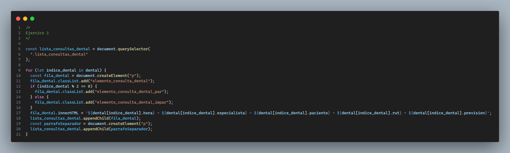

Este repositorio contiene el código con el cual he dado solución al tercer desafío evaluado del módulo **Fundamentos de programación en JavaScript** de la beca Desarrollo de aplicaciones Full Stack Javascript Trainee V2.0 dictada por DesafíoLatam.

Los requisitos del proyecto son los siguientes:

A continuación muestro un screenshot de mi proyecto:

Ahora procedo a explicar cada una de las soluciones:

## 1. Ejercicio 1 y 2

En primer lugar para el ejercicio 1, he creado un arreglo con objetos con las propiedades **hora**,**especialista**,**paciente**,**rut** y **previsión** para luego agregar dichos elementos al arreglo llamado **traumatología** utilizando el método push el cual recibe como argumento cada elemento del array **nuevosRegistrosTraumatologia** vía el operador rest (...).

En el ejercicio 2, remuevo el primer elemento del array **radiología** utilizando el método **shift** y remuevo el último elemento del array **radiología** utilizando el método **pop**.

## 2. Ejercicio 3

Para mostrar en pantalla las consultas médicas del área dental, selecciono la sección del HTML donde mostraré los elementos vía JavaScript utilizando la API del DOM. Luego creo un contenedor, le agrego una clase para darle estilos, luego recorro el array **dental** y creo un elemento p vía JavaScript, le añado una clase y según si es el índice par o impar agrego clases distintas para posteriormente darle estilos vía CSS, luego sobre el elemento p utilizo innerHTML para setear el contenido de ese tag p y, por último, agrego el párrafo a la sección vía el método **appendChild** para luego agregar un párrafo separador según lo dicho en los requisitos.

## 3. Ejercicio 4

En primer lugar, creo un arreglo con todos los nombres de los pacientes utilizando el método **map** para, posteriormente, unir todos los elementos de los arreglos vía el operador rest (...). A continuación, sigo el mismo procedimiento que el ejercicio anterior: selecciono la sección donde mostraré los nombres de los pacientes, creo un contenedor, creo un tag p usando el método **createElement**, seteo su contenido vía el método **innerHTML** recorriendo el arreglo de nombres de los pacientes, agrego dicho tag p al contenedor y después agrego dicho contenedor a la sección.

## 4. Ejercicio 5

Procedo a filtrar del arreglo **dental** solo aquellos objetos tales que su previsión sea ISAPRE utilizando el método **filter**. Para mostrar los elementos en pantalla sigo los mismos procedimientos anteriores: selecciono la sección donde irá la data, creo un contenedor, le agrego una clase, procedo a recorrer la lista de elementos del arreglo dental con previsión ISAPRE tal que en cada iteración creo un tag p, seteo su contenido con innerHTML, agrego dicho p al contenedor y post ciclo for, agrego el contenedor a la sección donde irá la data.

## 5. Ejercicio 6

Del array **traumatología** procedo a filtrar aquellos pacientes que presentan previsión FONASA y para mostrar la data en pantalla sigo el mismo procedimiento realizado en ejercicios anteriores.
